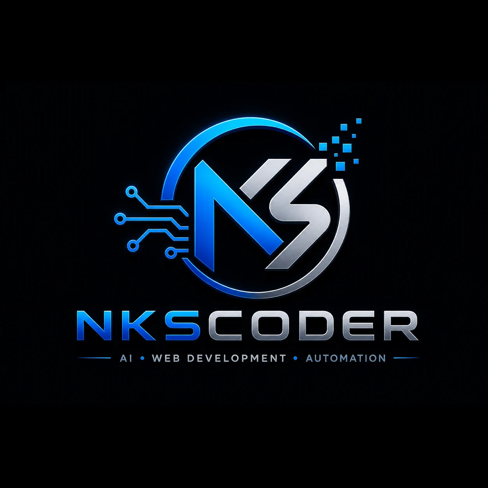

<p align="center">
  
</p>

<h1 align="center">Nitesh Kumar Singh · NKSCoder</h1>

<p align="center">
  <strong>AI Developer for Banking &amp; Fintech</strong><br>
  NVIDIA GPU · Ollama · LangGraph · FastAPI · CIBIL · Bank Statement Analysis
</p>

<p align="center">
  <a href="https://nkscoder.in"><strong>🌐 nkscoder.in</strong></a> ·
  <a href="https://github.com/nkscoder">GitHub</a> ·
  <a href="https://www.linkedin.com/in/nitesh-kumar-singh-897437a2/">LinkedIn</a> ·
  <a href="https://pypi.org/user/nkscoder/">PyPI</a> ·
  <a href="https://nkscoder.in/blog/">Blog</a> ·
  <a href="https://nkscoder.in/contact.html">Contact</a>
</p>

<p align="center">
  
  
  
  
  
  
  
</p>

---

## About

Portfolio of **Nitesh Kumar Singh** — **[NKSCoder](https://nkscoder.in)**. AI developer building **bank statement analysis**, **NBFC loan underwriting**, and production **NVIDIA GPU + Ollama** LLM systems at **Airtel Payments Bank** (Quess Corp Ltd).

| | |
|---|---|
| **Name** | Nitesh Kumar Singh |
| **Role** | AI Developer for Banking & Fintech |
| **Experience** | 11+ years |
| **Location** | New Delhi, India |
| **Current** | Airtel Payments Bank — bank statement AI (NVIDIA GPU, Ollama, Ray) |
| **Email** | nkscoder@gmail.com |
| **Phone** | +91 7827495599 |
| **Website** | [nkscoder.in](https://nkscoder.in) |
| **GitHub** | [github.com/nkscoder](https://github.com/nkscoder) |
| **LinkedIn** | [Nitesh Kumar Singh](https://www.linkedin.com/in/nitesh-kumar-singh-897437a2/) |
| **PyPI** | [pypi.org/user/nkscoder](https://pypi.org/user/nkscoder/) |

> **Search:** Nitesh Kumar Singh · nkscoder · AI developer bank statement · NVIDIA GPU Ollama · NBFC loan underwriting · CIBIL integration · LangGraph FastAPI

---

## Case studies & blog

| Topic | Link |
|-------|------|
| **NBFC Platform — Part 1** (multi-bank parsing) | [Case study](https://nkscoder.in/blog/bank-statement-nbfc-part-1-platform-parsing.html) |
| **NBFC Platform — Part 2** (LangGraph, CIBIL, reports) | [Case study](https://nkscoder.in/blog/bank-statement-nbfc-part-2-ai-reports.html) |
| **NVIDIA GPU + Ollama production** | [Case study](https://nkscoder.in/blog/bank-statement-analysis-ollama-gpu.html) |
| **Ray in LLM pipelines** | [Article](https://nkscoder.in/blog/ray-role-in-llm-pipelines.html) |
| **All articles** | [nkscoder.in/blog](https://nkscoder.in/blog/) |

---

## What I build

- **Bank statement analysis** — HDFC, SBI, ICICI, Axis, Kotak PDF/Excel parsing, OCR, bulk upload
- **NBFC underwriting** — loan eligibility, CIBIL integration, fraud/EMI/salary/bounce detection
- **AI & LLM** — NVIDIA GPU, CUDA, Ollama, LangGraph, LangChain, Qdrant RAG, Hinglish chat
- **Fintech backends** — FastAPI, Django, Next.js, PostgreSQL, Celery, RabbitMQ, Ray
- **Open source** — 7 Django packages on [PyPI @nkscoder](https://pypi.org/user/nkscoder/)

---

## Tech stack

| Area | Technologies |
|------|----------------|
| **AI & GPU** | NVIDIA GPU, CUDA, Ollama, LangGraph, LangChain, Qdrant, Ray |
| **Backend** | Python, FastAPI, Django, DRF, Celery, RabbitMQ |
| **Frontend** | Next.js, HTML/CSS, JavaScript |
| **Data** | PostgreSQL, Pandas, pdfplumber, PyMuPDF |
| **Cloud & DevOps** | Docker, AWS (EC2, S3, RDS), Linux, CI/CD |

---

## Site pages

| Page | URL |
|------|-----|
| Home | [nkscoder.in](https://nkscoder.in) |
| Blog | [nkscoder.in/blog/](https://nkscoder.in/blog/) |
| Contact | [nkscoder.in/contact.html](https://nkscoder.in/contact.html) |
| Studio | [nkscoder.in/login/](https://nkscoder.in/login/) |

---

## Repository

Static site on [GitHub Pages](https://pages.github.com/) with custom domain **nkscoder.in**.

```bash
git clone https://github.com/nkscoder/nkscoder.github.io.git
cd nkscoder.github.io
# Open index.html locally or use any static server
python -m http.server 8080
```

---

## License

© 2026 Nitesh Kumar Singh · [NKSCoder](https://github.com/nkscoder)
