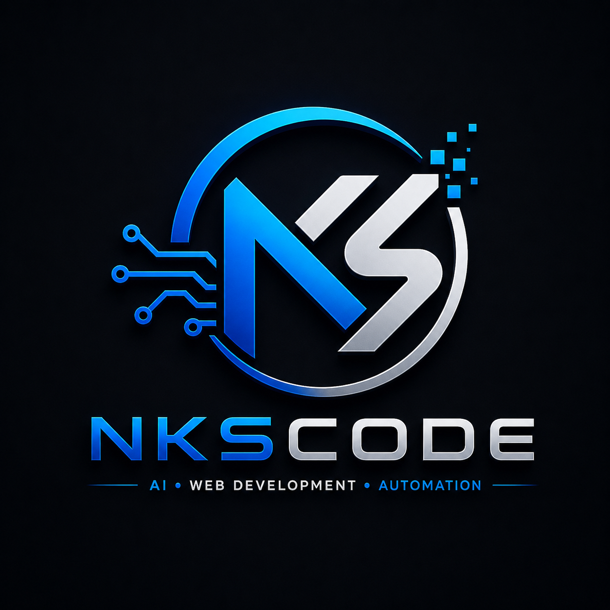

<p align="center">
  
</p>

<h1 align="center">NKSCoder</h1>

<p align="center">
  <strong>Official portfolio of Nitesh Kumar Singh</strong><br>
  Senior Software Developer · 12+ Years Experience
</p>

<p align="center">
  <a href="https://nkscoder.in">🌐 Website</a> ·
  <a href="https://github.com/nkscoder">👤 GitHub Profile</a> ·
  <a href="https://nkscoder.in/contact.html">✉️ Contact</a> ·
  <a href="https://nkscoder.in/login/">🚀 Studio</a>
</p>

<p align="center">
  
  
  
  
  
</p>

---

## About

Portfolio website featuring **AI**, **Django**, **PostgreSQL**, **AWS**, and **Linux** projects by [NKSCoder](https://github.com/nkscoder).

| | |
|---|---|
| **Name** | Nitesh Kumar Singh |
| **Role** | Senior Software Developer |
| **Experience** | 12+ years |
| **Email** | nkscoder@gmail.com |
| **Website** | [nkscoder.in](https://nkscoder.in) |
| **GitHub** | [github.com/nkscoder](https://github.com/nkscoder) |

## Pages

| Page | URL |
|------|-----|
| Home | [nkscoder.in](https://nkscoder.in) |
| Contact | [nkscoder.in/contact.html](https://nkscoder.in/contact.html) |
| Studio | [nkscoder.in/login/](https://nkscoder.in/login/) |

## Tech Stack

- **Backend** — Django, Python, REST APIs
- **Database** — PostgreSQL
- **Cloud** — AWS (EC2, S3, RDS, Lambda)
- **AI** — LLM integration, automation
- **DevOps** — Docker, CI/CD, Linux

## Repository

This repo powers [GitHub Pages](https://pages.github.com/) with custom domain **nkscoder.in**.

```
git clone https://github.com/nkscoder/nkscoder.github.io.git
```

## License

© 2026 Nitesh Kumar Singh · [NKSCoder](https://github.com/nkscoder)
